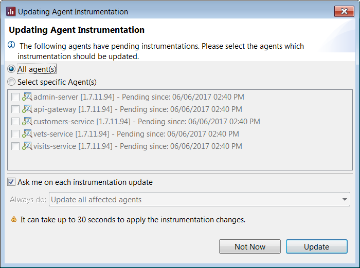

# Instrumentation configuration
The goal in this part of the workshop is to create a basic instrumentation for our sample application _Spring Petclinic Microservices_.

The prerequisite for this part is that you have finished the [setup part](PET_SETUP.md) of the workshop. We also assume that you have your _Spring Petclinic Microservices_ up and running with the five inspectIT agents.

## Configuration perspective
For all the instrumentation configurations you need to switch to the  *Configuration perspective*. As in all Eclipse-based application, perspective bar is available on the top-right of your application window.

## Environment creation
The first thing to do is to create a new environment that will be used by the inspectIT agents that runs within the sample application. From the  **Configuration Manager** view click on the  *Add* menu item and select the *Create Environment* option. Define the environment name (for example *Pet_Clinic* or any that you like) and click on *Finish*.

You will notice that the created Environment comes with some default settings.  For example several common profiles are already selected:
 - **[Common] Exclude classes** - defines the default exclude classes patterns. This profile should always be included to insure the correct functioning of the inspectIT agent.
 - **[Common] HTTP** - defines configuration for instrumenting the HTTP calls. As our application is web based, we will keep this profile included.
 - **[Commons] Remote-HTTP** - defines configuration for instrumenting remote http calls between different JVMS. As our application consists of several JVMs, we will keep this profile included.
 - **[Commons] Remote-JMS** - defines configuration for instrumenting remote jms calls between different JVMS. As our application does not use JMS, we can exclude this profile.
 - **[Commons] SQL** - defines configuration for instrumenting database calls. As our application uses H2 database in the back-end, we will also keep this profile included.

## Profile definition
### Create new profile
We need a profile where all our instrumentation points for the monitored application will be defined.  From the  **Instrumentation Manager** view click on the  *Add* menu item and select the *Create Profile* option. Define the profile name (for example *Petclinic_profile* or any that you like). For the profile type make sure that you select *Sensor assignment* and click on *Finish*.

### Define instrumentation points
The new profile does not contain any sensor assignment. We will add several instrumentations points for the Timer sensor, Exception sensor, and Remote Manual Server Sensor:

##### 1. Capture the response time of requesting details of a pet owner
For the warm up we would like to know, how long it takes to get details about a specific owner (method getOwnerDetails() in the class org.springframework.samples.petclinic.api.boundary.web.ApiGatewayController). To do that also add a new *Timer sensor* and add the following details to this definition:
```
Fully Qualified Name: org.springframework.samples.petclinic.api.boundary.web.ApiGatewayController
Method / Method Name: getOwnerDetails
Method visibility: public
```

##### 2. Capture details of a pet owner
Having defined a timer sensor for the getOwnerDetails() method, we also would like to know some details about the owner. We would like to capture the id of the owner and the firstname. To capture these information open the timer sensor of step 2. In the "Sensor Specific Options" active "Capture context". Click on  and a new window will pop up. First define:
```
Catch type: Parameter
Index: 0
Display name: owner-id
```

Click ok and add a second catch type to retrieve the firstname of the owner:

```
Catch type: Return value
Display name: owner-firstname
Click "Add path" and type: firstName
```

##### 3. ExecuteQuery methods
Now, we would like to instrument all the public executeQuery() methods implementing the interface `java.sql.Statement`.  In the **Sensor Definitions** page click on the  *Add* option and select *Timer sensor*. In the assignment details perform the following definition:
```
Interface: yes
Fully Qualified Name: java.sql.Statement
Method / Method Name: executeQuery
Method visibility: public
```

##### 4. All java.lang.ClassCastException exceptions 
inspectIT is capable of capturing information about any exception being thrown in the JVM. We would like to use this option and catch all all ClassCastException being thrown. Add a new sensor assignment definition and choose *Exception sensor*. Then perform the following definition:
```
Fully Qualified Name: java.lang.ClassCastException
```

##### 5. Remote Manual Server Sensor (Optional Step)
In order to intercept server requests independent of technology and library/framework "Remote Manual Server Sensor" can be used. These are useful to mark custom trace start points. We would like to mark start points for the communication with the Eureka Server. We like to see the calls refreshRegistry() and renew(). Add two new Senor Definition and choose "Remote Manual Server Sensor" for each. Then add the following definitions: 
 ```
Fully Qualified Name: com.netflix.discovery.DiscoveryClient
Method / Method Name: refreshRegistry
Method visibility: public, protected, default, private
```

```
Fully Qualified Name: com.netflix.discovery.DiscoveryClient
Method / Method Name: renew
Method visibility: public, protected, default, private
```

### Include to the environment
After defining all the instrumentation point please save the profile and include it to our *Pet_Clinic* environment. Open the environment from the **Instrumentation Manager** view and make sure that the new profile is selected in the *Profile* list. Save the environment. 

## Alter agent mapping settings
You are almost finished. We have defined environment that our agents should use and included in this environment one custom profile that contains all of our instrumentation points. The last step is to map the created environment to the inspectIT agents that will run in the _Spring Petclinic Microservices_ application.

In the **Instrumentation Manager** tool-bar select the  *Agent Mapping Settings* options. You should see that the current mappings define that all the agents should use the *Default Environment*:

Active | Agent Name | IP Address | Environment
--- | --- | --- | ---
✓ | * | * | Default Environment

Perform the following changes to create a new mapping that maps your *Petclinic_profile* to your *Pet_Clinic* environment:

1. Deactivate existing mapping for the Default Environment
2. Add new mapping:
``` 
Active: ✓
Agent name: * (All agents will use this environment)
IP address: *
Environment: Pet_Clinic
```

After performing the changes, you should see the new mapping:

Active | Agent Name | IP Address | Environment
--- | --- | --- | ---
✗ | * | * | Default Environment
✓ | * | * | Pet_Clinic

After saving the mapping settings inspectIT recognizes that the Petclinic agents does not have our instrumentation changes. Click ```Update``` on the dialog to send the new instrumentation to the agents.



After the update make sure that the new configuration works. Check the *Data Explorer View* of the agents api-gateway and see if new classes/methods/exceptions are instrumented. 

Furthermore, check if the details of the owner are captured. To do so, open the details of an owner in the Petclinic Application. Then switch to inspectIT and open in the *Data Explorer View* of the api-gateway agent the "Timer Data". In the Browser of the TimerData navigate to: org.springframework.samples.petclinic.api.boundary.web --> ApiGatewayController --> getOwnerDetails(int) and double click on it. In the table that it shown, right click on the entry and select: Navigate to --> Invocation(s). Choose one InvocationSequence and double click on it. In the InvocationSequence right click on the method getOwnerDetails and choose Details. In the details window the owner-id and the firstname will be displayed in the "Parameter Content Data" section. 

## Share your findings

You wonder how you store your findings for later access or how you can share your instrumented data with others? Check out the next section [Collaboration](PET_COLLABORATION.md) to find answers to your questions.
